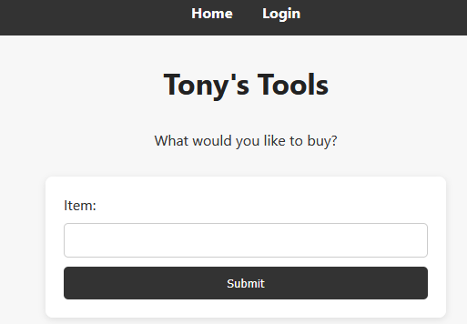
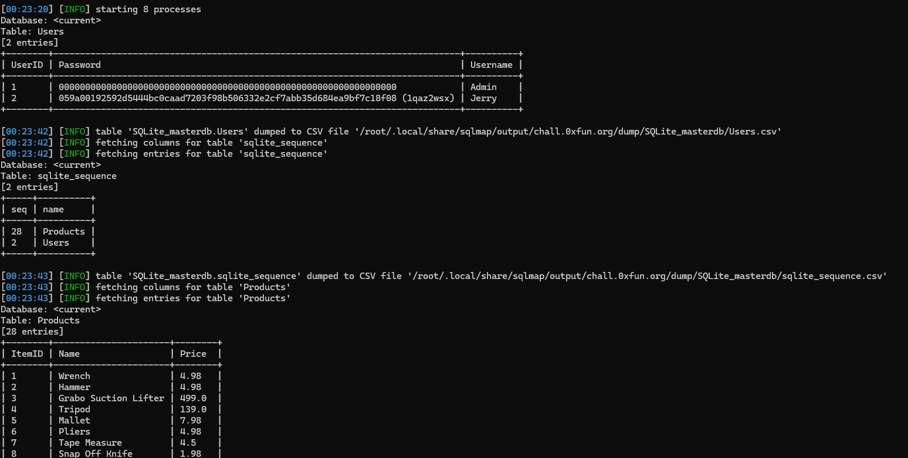
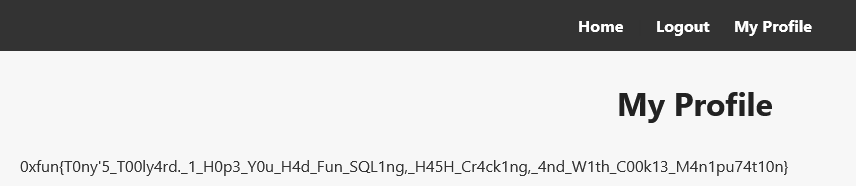

# Tony Toolkit

- [🗞️ INFO](#️-info)
- [📝 Wording](#-wording)
- [🛠️ Tools](#️-tools)
- [🧠 Write Up](#-write-up)

## 🗞️ INFO

**Platform**: 0xFun

**Category**: web

**Difficulty**: beginner

**Link**: <https://ctf.0xfun.org/challenges>

## 📝 Wording

> Tony decided to launch bug bounties on his website for the first time, so it’s likely to have some very common vulnerabilities.

## 🛠️ Tools

- SQLMap

## 🧠 Write Up

Sur le site, il y a deux page, une de login et une autre où on peut chercher un item

On peut SQLMap le premier formulaire d'image: `sqlmap --forms --batch -u "http://chall.0xfun.org:12139"`

Le champs est donc bien injectable, c'est une SQLight derrière.

On lance une nouvelle commande pour dump les tables: `sqlmap --batch -u "http://chall.0xfun.org:12139/search?item=test" -p item --dump-all`

On trouve 2 tables, la table produit et la table users, avec un user et son mot de passe que sqlmap a dehash

On ne peut pas se connecter avec l'admin car aucune entrée ne donne son hash
On peut donc maintenant se connecter avec **Jerry:1qaz2wsx**

On voit que son cookie de session est comme ça: `Cookie: userID=2; user=0cea94be4ad3fc313cee0f65c3fd5dbc5dcf93d7e1bb337f2ecac06e52f29c28`

On essaye de modifier le userID par 1, et on devient Admin.

**Flag**: *0xfun{T0ny'5_T00ly4rd._1_H0p3_Y0u_H4d_Fun_SQL1ng,_H45H_Cr4ck1ng,_4nd_W1th_C00k13_M4n1pu74t10n}*
