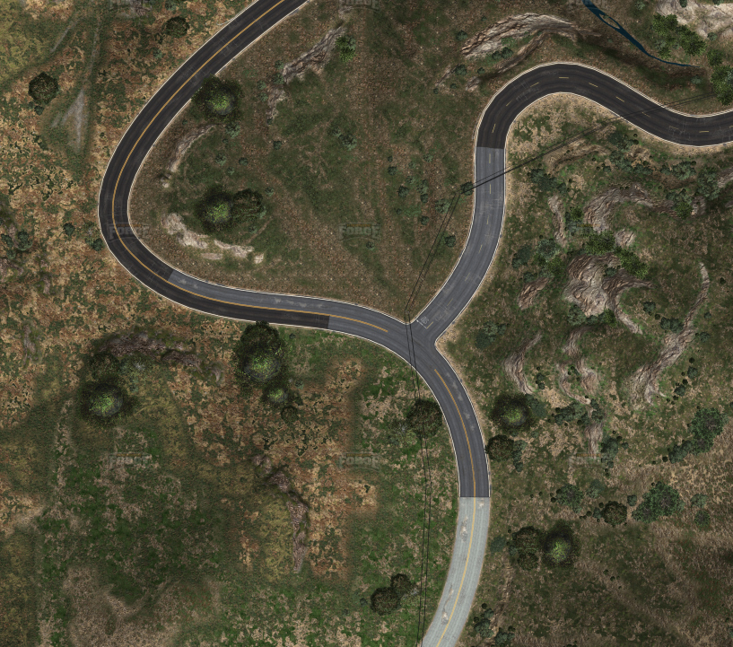
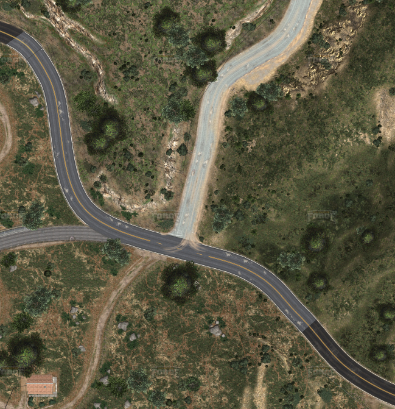

# Where’s Franklin ?

- [🗞️ INFO](#️-info)
- [📝 Wording](#-wording)
- [🛠️ Tools](#️-tools)
- [🧠 Write Up](#-write-up)

## 🗞️ INFO

**Platform**: 0xFun

**Category**: forensics

**Difficulty**: easy

**Link**: <https://ctf.0xfun.org/challenges>

## 📝 Wording

> Franklin took a little trip… but where did he end up?
> Flag format: 0xfun{Street_Name}

## 🛠️ Tools

- <https://forge.plebmasters.de/map?x=474.9521827182719&y=877.320544554456&z=5&b=Realmap&o>

## 🧠 Write Up

J'ai passé trop d'heure sur ce jeu donc à peu près où est ce lieu.

Avec la forme des virages, j'hésitait entre deux endroits:

Mais finalement le deuxième endroit va mieux car, comparé au premier endroit:

1. Il y a bien les lignes jaunes en face de la route
2. La route change bien de couleur
3. On voit les traces de terre

Et on trouve le nom de la rue facilement ensuite.

**Flag**: *0xfun{Marlowe_Drive}*
