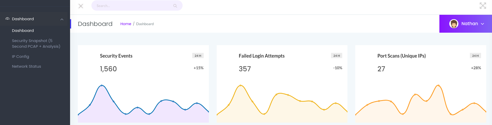
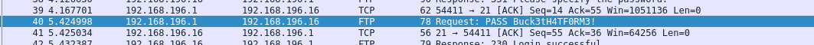
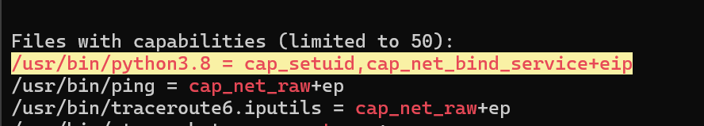

# Cap Machine

- [🗞️ INFO](#️-info)
- [📝 Wording](#-wording)
- [🛠️ Tools](#️-tools)
- [🧠 Write Up](#-write-up)

## 🗞️ INFO

**Platform**: HTB

**Category**: linux

**Difficulty**: easy

**Link**: <https://app.hackthebox.com/machines/Cap>

## 📝 Wording

/

## 🛠️ Tools

- Wireshark
- GTFOBins

## 🧠 Write Up

IP attaquant: *10.10.16.91*
IP target: *10.129.21.193*

Le ping fonctionne bien.
On commence par faire un nmap de la cible:
`nmap -T4 -A -Pn -p- -oA ./nmap/nmap 10.129.21.193`

On peut aller voir le site internet

Quand on va sur security Snapshot, on tombe sur un **pcap**, et on peut changer l'url de /data/2 en /data/0 pour avoir un autre pcap.

En analysant ce pcap, on trouve le mdp ftp

Le mdp semble être: **Buck3tH4TF0RM3!**

On peut se connecter en ssh avec le même mot de passe, et donc trouver le flag user.

Ensuite, on trouve ça avec LinPEAS:

Donc on peut maintenant devenir root: `/usr/bin/python3.8 -c 'import os; os.setuid(0); os.system("/bin/bash")'` et lire le flag.
